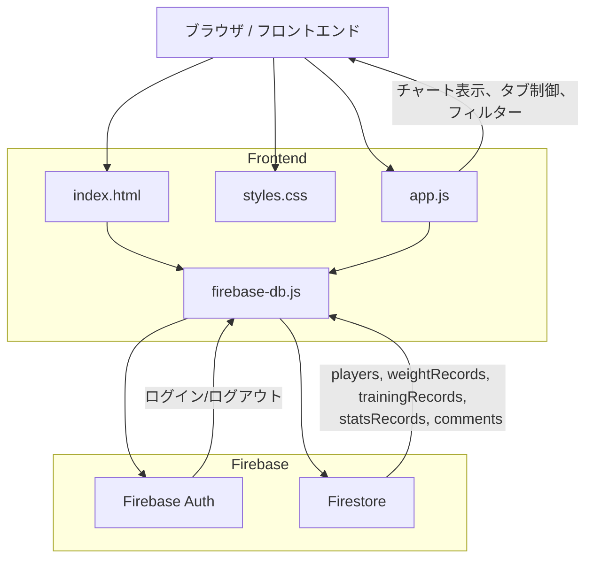

# フロントエンド / バックエンド アーキテクチャ図

## 1. アプリ概要

このアプリは、野球部の選手トレーニングと数値管理を行うWebアプリです。
ユーザーインターフェースは `index.html` / `styles.css` / `app.js` で構成され、
認証・データ保存は Firebase Authentication と Firestore により実装されています。

## 2. フロントエンド構成

### 2.1 主要構成ファイル

- `index.html`
  - UI の骨格とナビゲーション、画面タブを定義
  - Chart.js、Firebase SDK、`firebase-db.js` を読み込み
- `styles.css`
  - レイアウト、カラー、カードデザイン、レスポンシブ制御を担当
- `app.js`
  - タブ切り替え、グラフ生成、イベントリスナー、画面更新ロジック
  - ログイン状態による表示切り替え、マスター用/選手用の振る舞い
  - データ集計・フィルター処理、コメント表示などの UI ロジック
- `firebase-db.js`
  - Firebase Authentication / Firestore のラッパー関数
  - `window.fbLoginUnified` などの共通 API を公開

### 2.2 フロントエンドの役割

- UI 表示および画面遷移管理（サイドバー、タブ、モーダル）
- ログイン・ログアウト操作とロール管理
- Firestore からのデータ取得・更新要求
- Chart.js を使ったグラフ描画、データ集計、推移表示
- コメント・メッセージ履歴の表示および未読管理
- マスター用フィルターおよび選手選択機能
- レスポンシブ表示の制御と視覚テーマの切り替え

### 2.3 フロントエンド処理の詳細

#### 2.3.1 初期化と画面制御

- `DOMContentLoaded` で `app.js` が起動し、定数・ヘルパー関数を初期化
- サイドバーのタブ切り替え、モバイルメニュー開閉、ビュー切替ボタンを `initNavListeners()` でセット
- `applyViewMode()` で `viewport` を切り替え、PC/スマホ表示を保持するため `localStorage` を利用
- `applyRoleVisibility()` でマスターと選手それぞれに表示される UI 要素を制御

#### 2.3.2 チャート機能

- `createLineChart()` で Chart.js の共通作成ロジックを定義
- 体重、球速、ウエイトトレーニング、野球指標、比率の 5 つのチャートを生成
- `updateDashboardCharts()` がフィルタ条件と期間に応じて Firestore データを集計・描画
- `aggregateData()` で日次/週次/月次の集計を実行し、チャート表示用データに変換
- チャートデータは DOM のセレクト値や範囲指定値と連動し、即時更新される

#### 2.3.3 ダッシュボードと統計集計

- `updateDashboard()` が画面全体の更新を司る:
  - ロールの取得
  - フィルター設定の読み込み
  - Firestore からのレコード取得
  - 選手フィルタの適用
  - チャート・評価カード・コメント更新
- `getDashboardFilters()` で `マスター/選手` に応じたフィルター挙動を分岐
- `applyDashboardCriteria()` で学年・ポジション・特定選手の除外条件を適用
- `updateDashboardStats()` でダッシュボードカードの最新体重、最高球速、最高スクワット、遠投、単位仕事量を算出

#### 2.3.4 フォームとユーザー入力

- `handleFormSubmit(formId, storeKey, recordConstructor, successMessage)` で共通の登録ロジックをまとめる。
  - `formId` は HTML の `id` 属性（例: `weight-form`, `training-form`, `stats-form`）。
  - `storeKey` は Firestore のコレクション名（例: `weightRecords`, `trainingRecords`, `statsRecords`）。
  - `recordConstructor` は DOM から入力値を読み取って `record` オブジェクトを返す関数。
  - `successMessage` は保存成功時に表示するテキスト。
- `handleFormSubmit()` の処理フロー:
  1. フォームの `submit` イベントを `preventDefault()` で抑制。
  2. `localStorage` から `currentPlayerId` を取得し、選手が選択済みか確認。
  3. `recordConstructor()` を実行してフォーム入力を `record` に変換。
  4. `playerId` と `createdAt` を `record` に付与。
  5. `window.fbAddRecord(storeKey, record)` で Firestore に保存。
  6. 保存成功後に `alert(successMessage)` を表示。
  7. フォームを `reset()` し、日付入力を本日にリセット。
  8. `training-form` ではセット数を `3` に戻す。
  9. `updateDashboard()` と `renderHistory()` を呼び出して画面を再描画。
  10. 例外時は `console.error()` で記録し、`alert('保存に失敗しました。')` で通知。
- 各フォームの入力構造と使用可能な項目:
  - `weight-form`:
    - `weight-date`: 測定日（date）
    - `weight-time`: 測定時間（time）
    - `weight-val`: 体重（kg、数値、step 0.1）
    - `bodyfat-val`: 体脂肪率（%、数値、step 0.1、任意）
    - `weight-memo`: コンディションメモ
  - `training-form`:
    - `train-type`: トレーニング種目選択（必須）
      - `スクワット`
      - `ベンチプレス`
      - `ボックスジャンプ`
      - `10m走`
      - `メディシンボールスロー(前)`
      - `メディシンボールスロー(後ろ)`
      - `メディシンボールスロー(プッシュ)`
      - `メディシンボールスロー(サイド)`
      - `立幅`
      - `立ち三段`
      - `クリーン`
      - `ペンタゴンクリーン`
      - `フロントスクワット`
      - `デッドリフト`
    - `train-date`: 実施日（date）
    - `train-weight`: 重量（kg、数値、step 0.5）
    - `train-reps`: 回数（整数）
    - `train-sets`: セット数（整数、初期値 3）
  - `stats-form`:
    - `stat-type`: 記録項目選択（必須）
      - `球速 (km/h)`
      - `スイングスピード (km/h)`
      - `50m走 (秒)`
      - `遠投 (m)`
      - `回転数 (rpm)`
    - `stat-date`: 実施日（date）
    - `stat-val`: 記録数値（数値、step 0.01）
- `train-type` と `stat-type` はそれぞれ固定の `select` メニューで、
  トレーニング内容・野球指標のカテゴリを統一入力形式として扱う。
- `recordConstructor()` は各入力を `parseFloat()` / `parseInt()` で適切に変換し、
  文字列フィールドはそのまま `record` に格納する。
- 送信後は次の副作用が発生する。
  - フォームリセットと `date` フィールドの今日日付への再初期化。
  - ダッシュボードのチャートとカード統計の再計算。
  - 直近コメント・メッセージ未読状態の更新。
  - 履歴タブの再レンダリング。
- この設計により、フォーム種別ごとの保存処理の重複を排除し、
  保存後の画面更新を一貫化している。

#### 2.3.5 プレイヤー管理とマスター機能

- `loadPlayersForFilter()` で選手一覧を取得し、フィルタ用セレクトボックスを再構築
- `allPlayersCache` を使い名前検索フィルターを実装
- プレイヤー一覧画面では `renderPlayerList()` が
  - 編集ボタン
  - メッセージ送信ボタン
  - ロール変更セレクト
  - 削除ボタン
 などを生成
- `applyRoleVisibility()` により、マスター専用 UI 要素を表示/非表示
- プレイヤー追加は `addPlayer()`、削除は `deletePlayer()`、ロール変更は `fbUpdatePlayerRole()` で実施

#### 2.3.6 認証モーダルとログイン処理

- `showAuthModal()` でログインモーダルを表示し、選手一覧を読み込んで選択可能にする
- モーダル内は「ログイン」「登録」「マスター」「マスター登録」の複数ビューを持つ
- `btn-login` で `window.fbLoginUnified()` を呼び出し、選択された UID とパスワードで認証
- 認証成功時は `localStorage` に `userRole` と `currentPlayerId` を保存し、`initializeAppState()` を呼び出して画面を再初期化
- `btn-register` は選手登録処理、`btn-register-master` はマスター登録処理を担う

#### 2.3.7 UI テーマとサイドバープロフィール

- `applyThemeColor()` でテーマ色を CSS 変数として切り替え
- `updateSidebarProfile()` で右上プロフィール表示を更新
  - マスターなら固定テキスト表示
  - 選手なら選手情報に応じた名前・ポジション・アバターを表示
- アバターは DiceBear API を利用

## 3. バックエンド構成

### 3.1 Firebase をバックエンドとして利用

- Firebase Authentication
  - メール/パスワード認証を使用
  - `fbLoginUnified`, `fbRegisterUser`, `fbLogoutUser` などで呼び出し
- Firestore
  - 以下のコレクションを利用
    - `players`
    - `weightRecords`
    - `trainingRecords`
    - `statsRecords`
    - `comments`
  - ドキュメント ID は選手 UID を基本に使用
  - `players/{uid}.role` で `master` / `player` を管理

### 3.2 Firebase 連携の特徴

- フロントエンドから直接 Firestore を読み書き
- `firebase-db.js` が API 層として機能
- `fbGetRecords`, `fbAddRecord`, `fbUpdateRecord`, `fbDeleteRecord` などの共通処理
- `fbListenToComments` でコメントをリアルタイム購読

## 4. データフロー

1. ユーザーがブラウザで `index.html` にアクセス
2. `app.js` が画面を初期化し、`firebase-db.js` 経由で Firebase SDK を利用
3. ログイン時に Firebase Auth へ認証要求
4. 認証成功後、`players` コレクションから役割情報を取得
5. `weightRecords`, `trainingRecords`, `statsRecords`, `comments` を取得して表示
6. フロントエンドの操作により、Firestore のドキュメントを追加・更新・削除

## 5. アーキテクチャ図

### 5.1 Mermaid 図



### 5.2 ASCII 図

```
[Browser]
   |-- index.html
   |-- styles.css
   |-- app.js
   |-- firebase-db.js
        |-- Firebase Auth
        `-- Firestore
               |-- players
               |-- weightRecords
               |-- trainingRecords
               |-- statsRecords
               `-- comments
```

## 6. 役割分担のポイント

- フロントエンド: 画面表示・操作・グラフ描画・ユーザー体験
- バックエンド: Firebase Auth で認証、Firestore でデータ永続化
- 今の構成ではサーバーサイドコードは存在せず、Firebase が代替バックエンドとして動作

## 7. 今後の改善余地

- `firebase-db.js` をさらに小さな API モジュールに分割
- Security Rules を `firestore.rules` で厳密に定義
- バックエンド側でアクセス制御やビジネスロジックを追加する場合は Firebase Functions を検討
